# **Expense Manager** 💲
A full-stack **MERN (MongoDB, Express.js, React, Node.js)** web application for tracking and managing expenses efficiently.  

---

## **📸 Project Screenshots**

| Auth & Access | Dashboard & Home | Income & Expense |
|---------------|------------------|------------------|
| 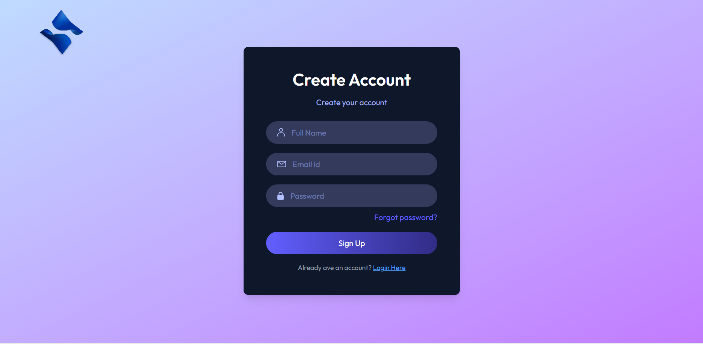 | 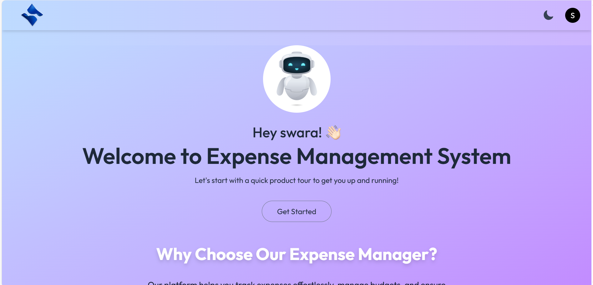 | 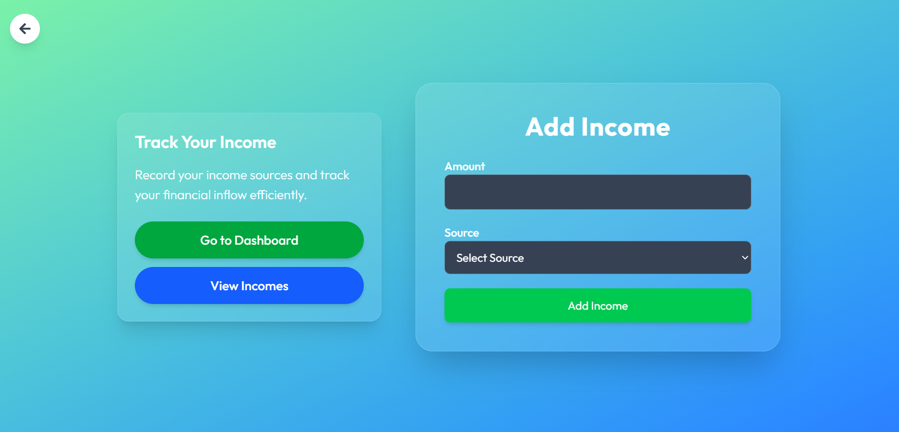 |
| 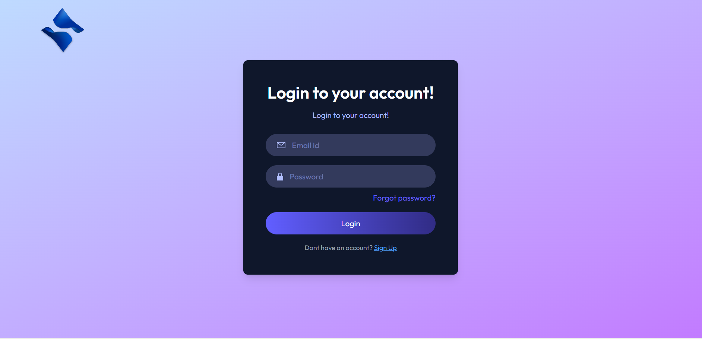 | 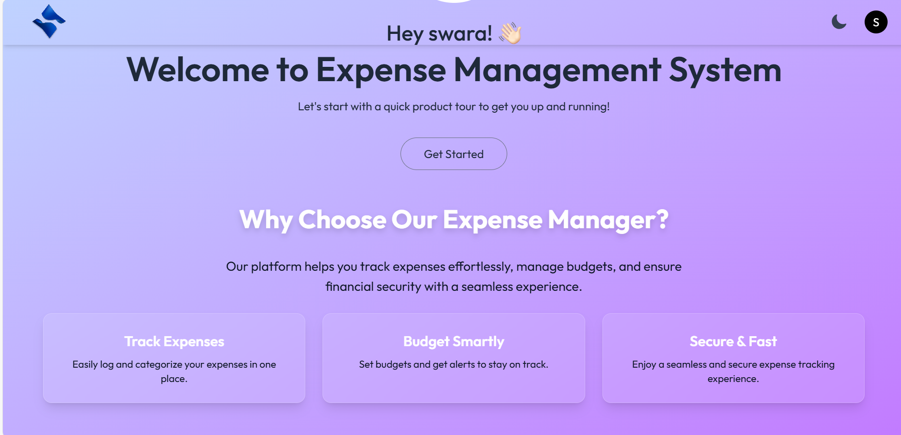 | 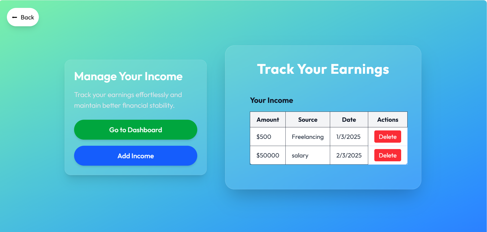 |
| 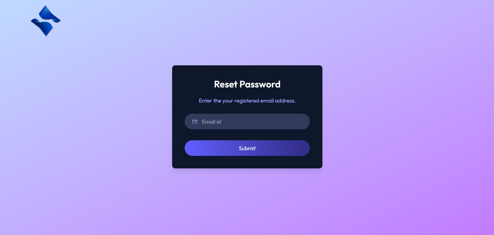 | 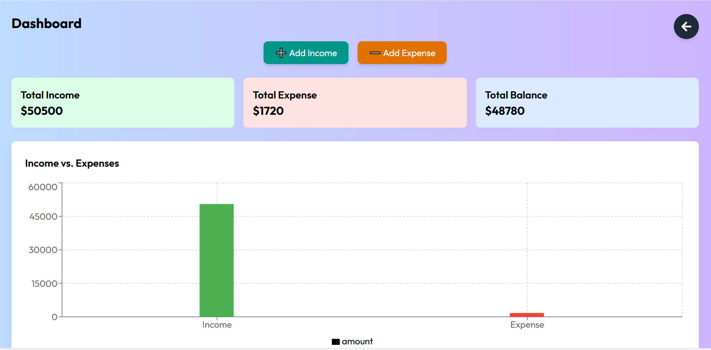 | 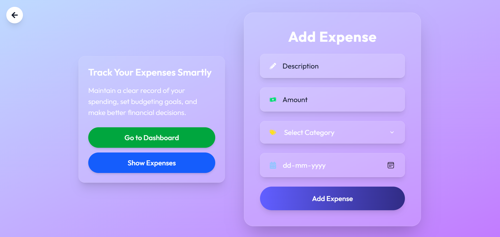 |
|  | 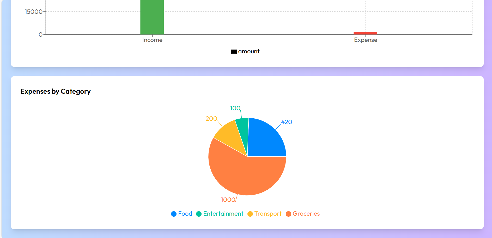 | 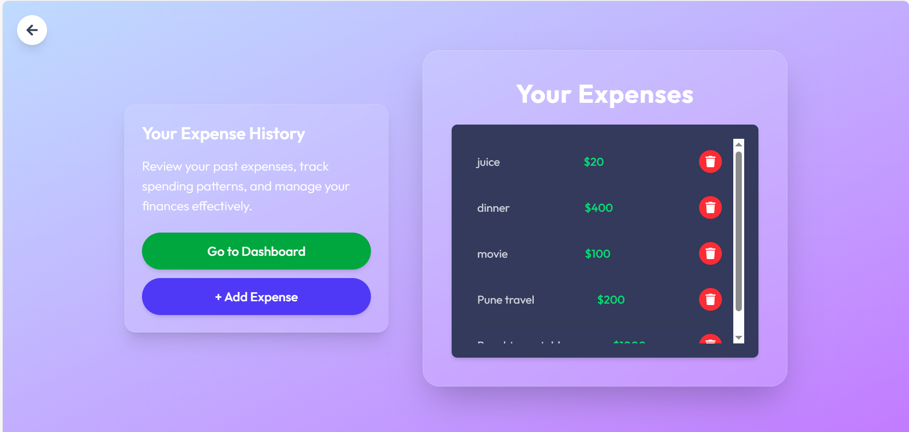 |

---

## **📌 Features**  
✅ User authentication (login/logout)  
✅ Add, edit, and delete income & expenses  
✅ Categorization of expenses  
✅ Real-time data visualization (charts/graphs)  
✅ Dark mode support 🌙  
✅ Responsive UI with **Tailwind CSS**  
✅ Secure data storage with **MongoDB Atlas**  

---

## **🛠 Tech Stack**  
- **Frontend**: React.js, Tailwind CSS  
- **Backend**: Node.js, Express.js  
- **Database**: MongoDB Atlas  
- **Authentication**: JWT (JSON Web Token)  
- **State Management**: React Context API  
- **UI Components**: Heroicons  

---

## **🚀 Installation & Setup**  

### **1️⃣ Clone the Repository**  
```sh
git clone https://github.com/Sakshi-0613/Expense_Manager.git
cd Expense_Manager
```

### **2️⃣ Setup Backend**  
```sh
cd server
npm install  # Install backend dependencies
```
- **Create a `.env` file** inside the `server` folder and add:  
  ```env
  MONGO_URI=your_mongodb_connection_string
  JWT_SECRET=your_secret_key
  PORT=4000
  ```
- Start the backend server:  
  ```sh
  npm start
  ```

### **3️⃣ Setup Frontend**  
```sh
cd client
npm install  # Install frontend dependencies
npm start    # Start the React app
```

### **4️⃣ Open the App**  
- Visit: **http://localhost:3000**  

---

## **📄 API Endpoints**  
| Method | Endpoint          | Description            |
|--------|------------------|------------------------|
| GET    | /api/income/     | Fetch user income     |
| POST   | /api/income/add  | Add a new income entry |
| DELETE | /api/income/:id  | Delete an income entry |
| GET    | /api/expense/    | Fetch user expenses   |
| POST   | /api/expense/add | Add a new expense entry |
| DELETE | /api/expense/:id | Delete an expense entry |

---

## **👤 User Roles & Authentication**  
- Users can sign up and log in.  
- JWT authentication is used for security.  
